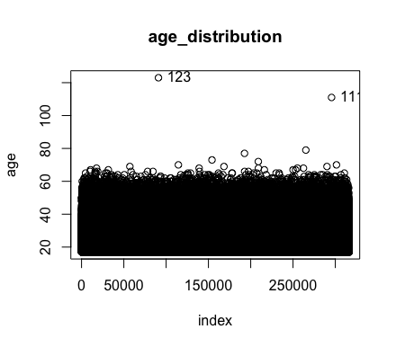
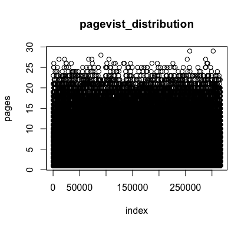
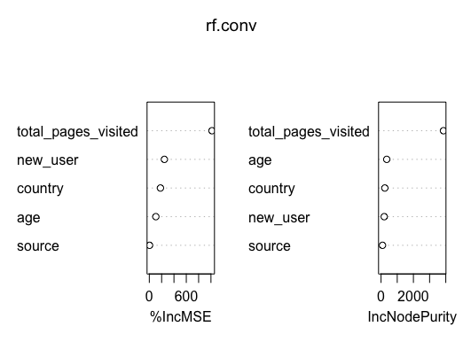
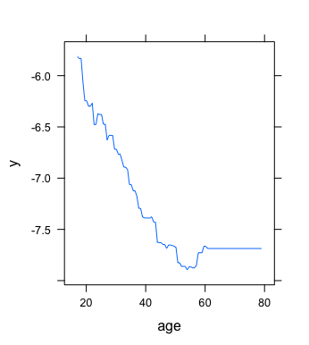
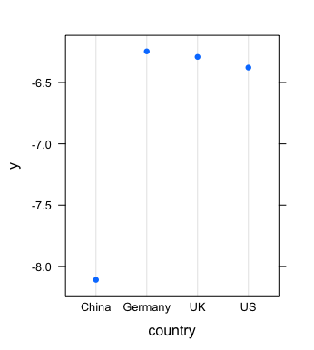
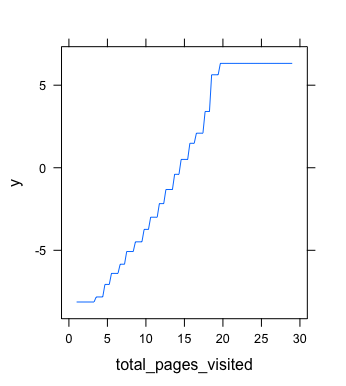

# Project 1: Conversion Rate
Random forest & Boosted trees

## Challenge Description
We have data about users who hit our site: whether they converted or not as well as some of their characteristics such as their country, the marketing channel, their age, whether they are repeat users and the number of pages visited during that session (as a proxy for site activity/time spent on site).
Your project is to:
1. Predict conversion rate
2. Come up with recommendations for the product team and the marketing team to improve conversion rate

Note:
comments are embedded in the code file

## EDA
I looked at the distribution the data and the values counts for the various numeric and categorical variables. Below are some highlights discoveries from the table. 

 

## Random Forest
Some highlights from random forest model.

## Boosted Trees
Some highlights from boosted trees model.

## Conclusion
Users in Germany seems to have the highest marginal effect on conversion rate 
among all the countries, whereas China has the lowest, which is significantly
lower than other countries. More data ought to be collected to find out what's going
on in China, maybe it's the local competitors, or government policy, or commercials 
and sources channels. However, market in Germany should be where we put most our
focus on. Specifially, we should be more focus on the ads, seo source in Germany, despite
of the fact that source is seemingly less important than other features. Additionally,
we should try to attract more young, new uses in Germany who, according to the result,
can result in high conversion rate.
